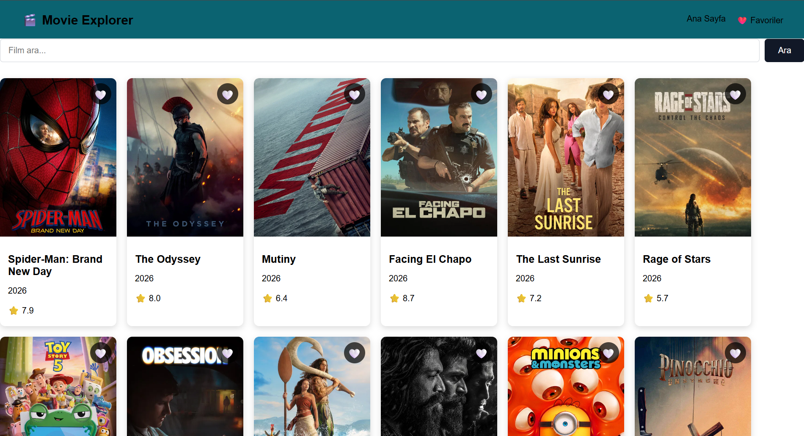
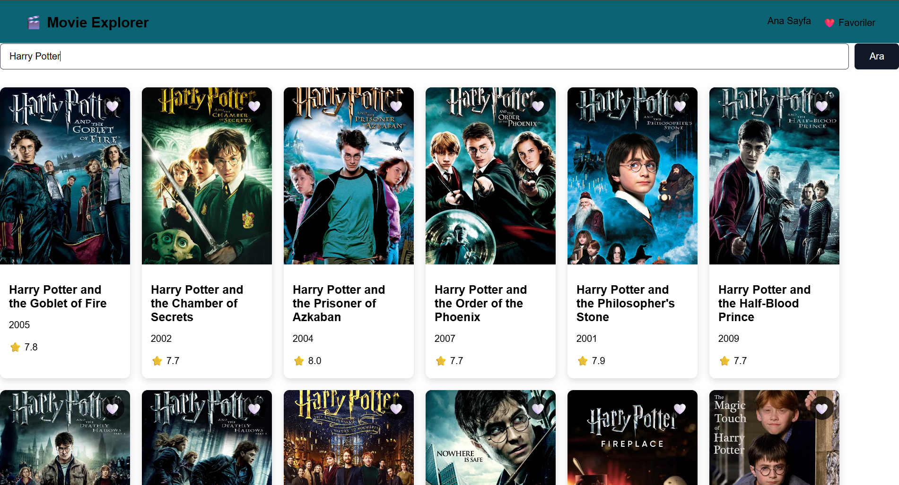
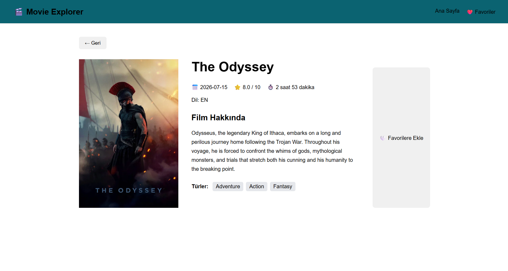
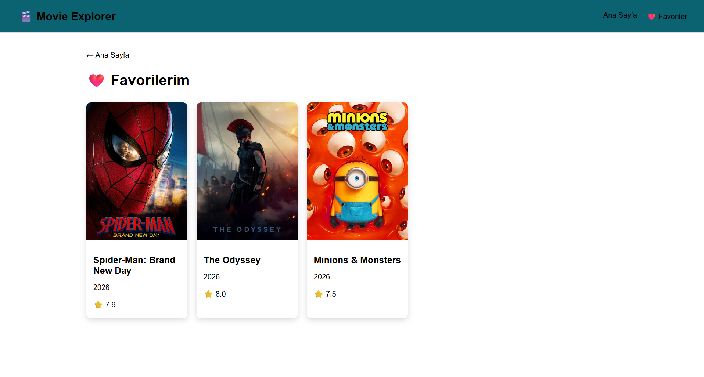
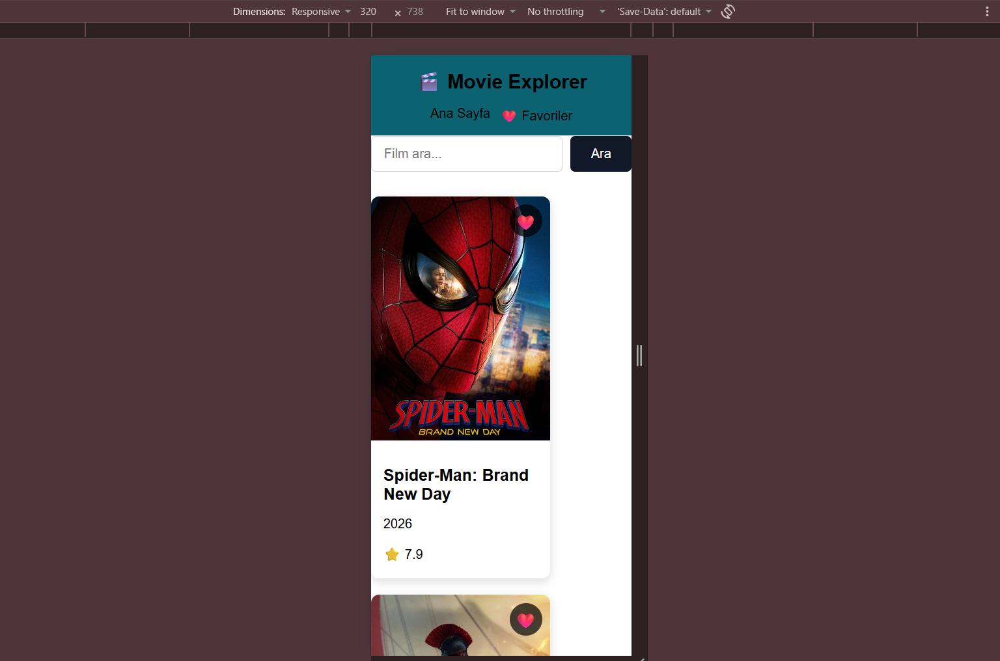

# Movie Explorer

React ve TMDB API kullanılarak geliştirilmiş film keşif uygulaması.

## Proje Hakkında

Movie Explorer, kullanıcıların popüler filmleri görüntüleyebildiği, film arayabildiği, filmlerin detaylarını inceleyebildiği ve beğendiği filmleri favorilerine ekleyebildiği bir web uygulamasıdır.

Proje, React öğrenme sürecinde öğrenilen temel React konularını uygulamak amacıyla geliştirilmiştir.

## Özellikler

- Popüler filmleri listeleme
- Film arama
- Film detaylarını görüntüleme
- Film posterlerini görüntüleme
- Film puanlarını görüntüleme
- Film türlerini görüntüleme
- Film süresini görüntüleme
- Favori film ekleme ve çıkarma
- Favorileri localStorage üzerinde saklama
- Dinamik film detay sayfaları
- Responsive tasarım
- 404 Not Found sayfası
- Loading durumları
- Error durumları

## Kullanılan Teknolojiler

- React
- JavaScript
- Vite
- React Router
- Axios
- TMDB API
- CSS
- localStorage

## Proje Yapısı

```text
src
├── components
│   ├── Header.jsx
│   ├── MovieCard.jsx
│   ├── MovieList.jsx
│   └── SearchBar.jsx
├── context
│   └── FavoritesContext.jsx
├── pages
│   ├── Favorites.jsx
│   ├── Home.jsx
│   ├── MovieDetail.jsx
│   └── NotFound.jsx
├── services
│   └── tmdbApi.js
├── App.jsx
├── App.css
└── main.jsx
```

## Kurulum

Projeyi bilgisayarınızda çalıştırmak için öncelikle repository'yi klonlayın:

```bash
git clone https://github.com/meleknazgecit/movie-explorer.git
```

Proje klasörüne girin:

```bash
cd movie-explorer
```

Gerekli bağımlılıkları yükleyin:

```bash
npm install
```

## API Ayarları

Proje, film verilerini TMDB API üzerinden almaktadır.

Projenin çalışması için kök dizinde `.env` dosyası oluşturulmalı ve API anahtarı aşağıdaki formatta eklenmelidir:

```env
VITE_TMDB_API_KEY=YOUR_API_KEY
```

Gerçek API anahtarı güvenlik nedeniyle repository içerisinde paylaşılmamaktadır.

Örnek ortam değişkenleri için `.env.example` dosyası kullanılabilir.

## Projeyi Çalıştırma

Gerekli bağımlılıklar yüklendikten ve `.env` dosyası oluşturulduktan sonra:

```bash
npm run dev
```

komutu ile geliştirme sunucusu başlatılabilir.

## Ekran Görüntüleri

### Ana Sayfa



### Film Arama



### Film Detay Sayfası



### Favoriler



### Mobil Görünüm



## Geliştirici

Melek Naz Geçit

Software Engineering Student